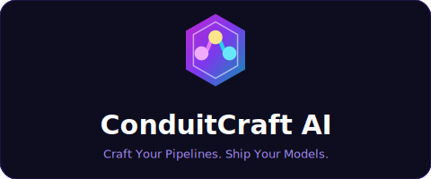
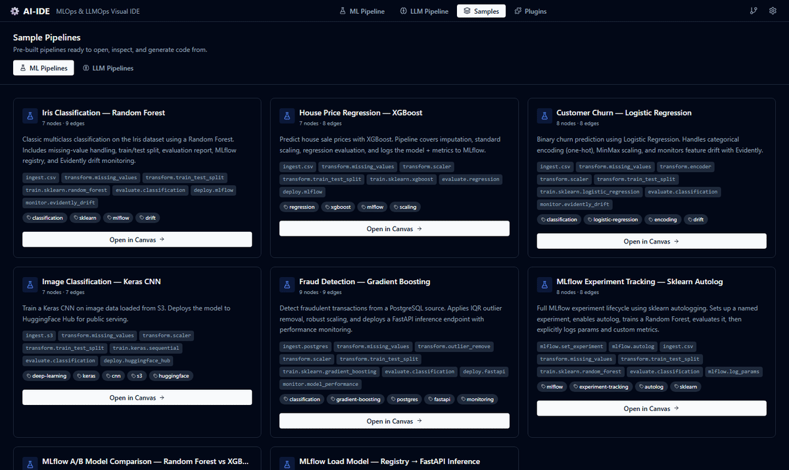

# ConduitCraft AI

<p align="center">
  
</p>

<p align="center">
  Open-source drag-and-drop IDE for building ML and LLM pipelines.<br/>
  Compose pipelines as flowcharts — ConduitCraft AI generates executable Python scripts,<br/>
  Jupyter notebooks, Kubeflow DSL, and Dockerfiles from the visual flow.
</p>

<p align="center">
  
</p>

---

## Features

- **Visual pipeline builder** — drag nodes onto a canvas, connect them with typed edges
- **Dual pipeline modes** — ML Pipeline (scikit-learn, Keras, PyTorch, XGBoost) and LLM Pipeline (LangChain, OpenAI, Anthropic Claude, Ollama, Pinecone)
- **Code generation** — one click produces Python scripts, Jupyter notebooks, Kubeflow DSL, or Dockerfiles
- **Port type validation** — incompatible connections are blocked at draw time with a clear type-mismatch error; the Validate button scans the whole pipeline
- **Data connectors** — local files, AWS S3, Azure Blob, GCS, PostgreSQL, HuggingFace Datasets
- **MLOps integrations** — MLflow (experiment tracking, model registry, autolog), Kubeflow Pipelines, HuggingFace Hub
- **Plugin system** — community plugins add new node types via an iframe sandbox and `postMessage` API
- **Pipeline execution** — run locally or inside Docker with real-time WebSocket log streaming and per-node status indicators
- **Sample pipelines** — pre-built ML and LLM templates to get started instantly
- **Desktop app** — Electron wrapper with a bundled FastAPI backend (PyInstaller) for Windows, macOS, and Linux — no Python installation required

## Quick Start

### Prerequisites

| Tool | Version |
|---|---|
| Node.js | ≥ 20 |
| pnpm | ≥ 9 |
| Python | ≥ 3.11 |
| uv | latest |

Install uv (Python package manager):
```bash
# macOS / Linux
curl -LsSf https://astral.sh/uv/install.sh | sh

# Windows (PowerShell)
powershell -ExecutionPolicy ByPass -c "irm https://astral.sh/uv/install.ps1 | iex"
```

### Installation

```bash
git clone https://github.com/conduit-studio/conduit-studio.git
cd conduit-studio

# Install Node dependencies
pnpm install

# Install Python dependencies
cd apps/backend
uv sync
cd ../..
```

### Running in Development

Open two terminals:

**Terminal 1 — Frontend**
```bash
pnpm dev:web
# → http://localhost:3000
```

**Terminal 2 — Backend**
```bash
cd apps/backend
uv run uvicorn app.main:app --reload --port 8000
# → http://localhost:8000
```

Open http://localhost:3000 in your browser.

> The backend is required for **code generation** and **pipeline execution**. The visual canvas and sample pipelines work without it.

## Project Structure

```
conduit-studio/
├── apps/
│   ├── web/          # React 18 + Vite browser app (port 3000)
│   ├── desktop/      # Electron wrapper + PyInstaller bundled backend
│   └── backend/      # FastAPI execution engine + code generator (port 8000)
├── packages/
│   ├── canvas-engine/    # React Flow canvas + Zustand store + port validation
│   ├── node-registry/    # All built-in node definitions (ML + LLM)
│   ├── plugin-sdk/       # SDK for building community plugins
│   ├── types/            # Shared TypeScript interfaces
│   └── ui/               # Shared shadcn/ui component library
└── plugins/              # Official bundled plugins
```

## Pipeline Modes

### ML Pipeline
```
Data Ingestion → Transform → Train → Evaluate → Deploy → Monitor
```
Supported frameworks: scikit-learn, XGBoost, Keras/TensorFlow, PyTorch
MLOps: MLflow experiment tracking · Kubeflow Pipelines · HuggingFace Hub

### LLM Pipeline
```
Ingest → Chunk → Embed → VectorStore → LLM → Chain/Agent → Deploy → Monitor
```
LLMs: OpenAI · Anthropic Claude · Ollama · vLLM
Chains: LangChain · LangGraph · LlamaIndex
Vector stores: Chroma · FAISS · Pinecone

## Building for Desktop

```bash
# 1. Build the backend executable (from apps/backend/)
cd apps/backend
uv run pyinstaller conduit-backend.spec

# 2. Package the Electron app (from apps/desktop/)
cd ../desktop
pnpm dist
```

See [BUILD.md](BUILD.md) for full build and packaging instructions.

## Tech Stack

| Layer | Technology |
|---|---|
| Frontend | React 18, TypeScript, React Flow v12, Vite, Tailwind CSS, shadcn/ui |
| State | Zustand + Immer |
| Backend | Python 3.11, FastAPI, uvicorn, Jinja2 |
| Desktop | Electron 33, PyInstaller |
| Monorepo | Turborepo + pnpm workspaces |

## Plugin System

Plugins live in `~/.conduitcraft/plugins/`. Each plugin ships a `plugin.manifest.json` and communicates with the host via `postMessage`:

```json
{
  "id": "com.example.my-connector",
  "name": "My Connector",
  "version": "1.0.0",
  "nodeTypes": ["my.ingest.source"],
  "permissions": ["network", "credentials"],
  "apiVersion": "1"
}
```

## Contributing

1. Fork the repository
2. Create a feature branch: `git checkout -b feature/my-feature`
3. Make your changes
4. Submit a pull request

## License

Apache 2.0 — see [LICENSE](LICENSE).
